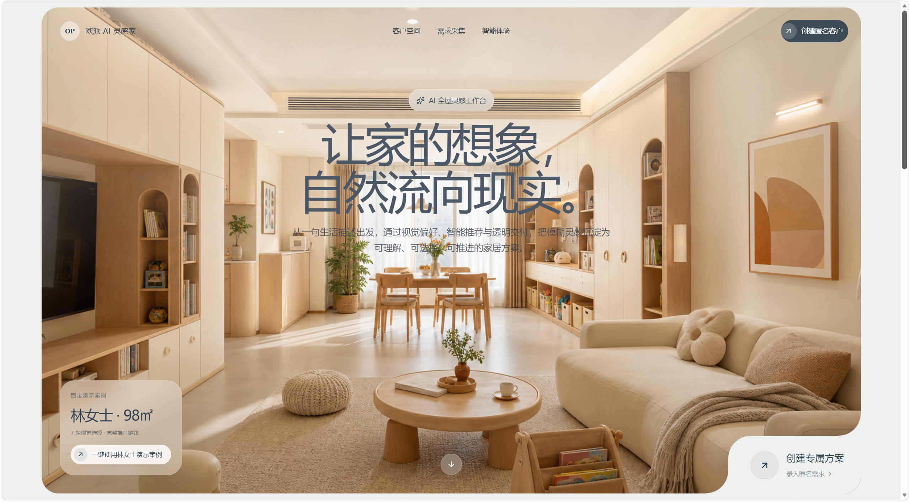
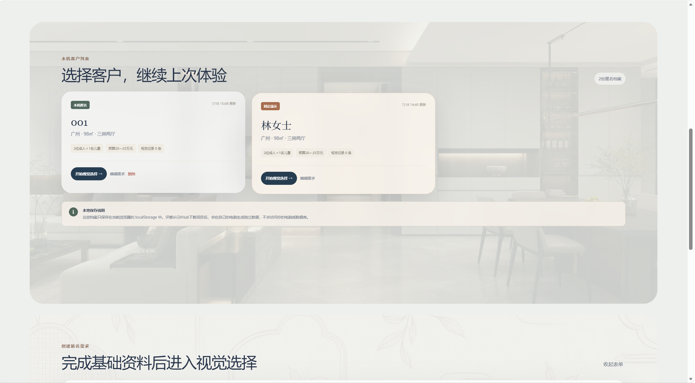
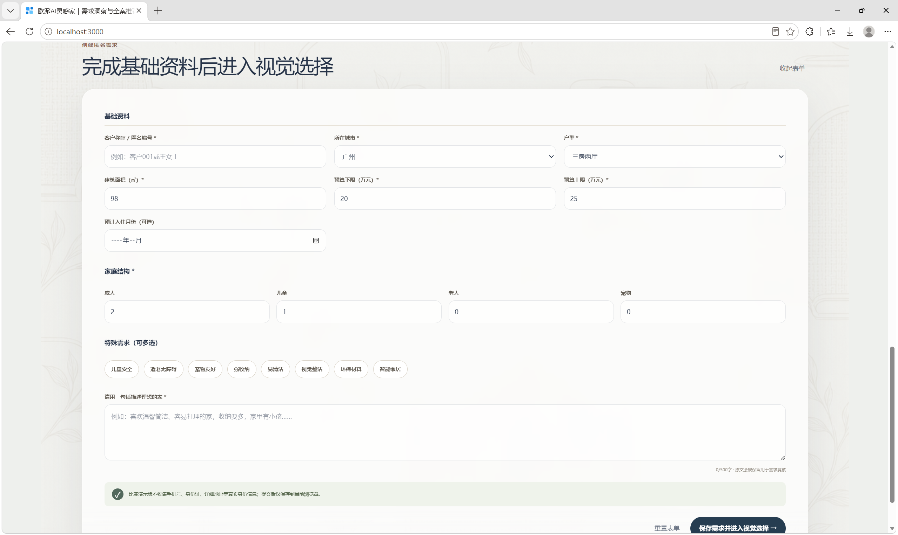
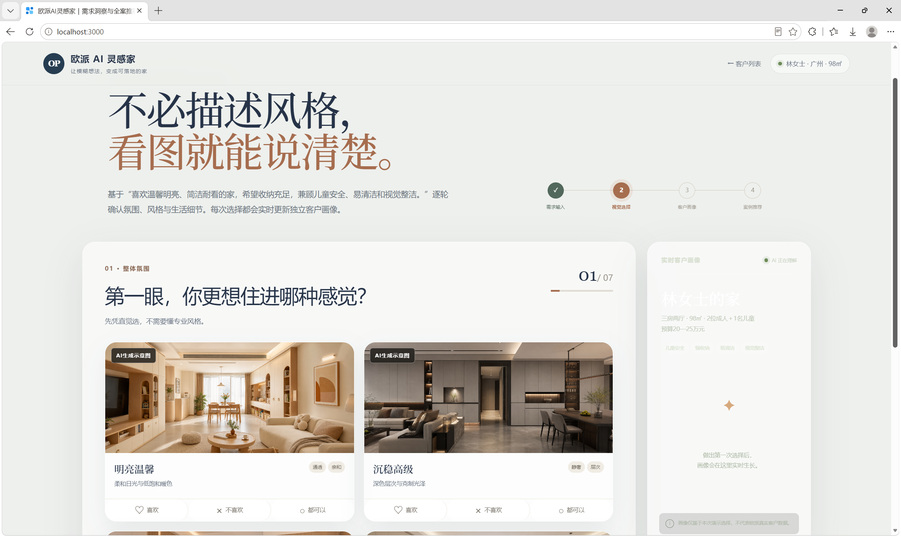

# 网页部分展示





# 欧派AI灵感家

基于成交案例库的客户需求洞察与全案推荐系统，用于“AI + 客户体验”比赛MVP演示。

系统从完整需求输入开始，支持在同一浏览器创建、切换和恢复多名匿名客户；随后通过七轮视觉选择形成独立客户画像，识别需求冲突，推荐三套可解释方案，并将所选方案带入八阶段交付看板和风险预警流程。

## 已实现能力

- PRD规定的城市、户型、面积、预算、家庭结构、入住时间、特殊需求和自由描述输入
- 匿名客户列表、创建、编辑、切换、删除与林女士一键演示案例
- 基于浏览器 `localStorage` 的多客户独立保存和刷新恢复，无需PostgreSQL
- 七轮视觉偏好选择：喜欢、不喜欢、都可以、跳过、撤销上一步
- 实时客户画像与“20%开放＋80%封闭”冲突建议
- 基于60条脱敏模拟案例的三策略推荐
- 七项固定权重评分、推荐理由和预算重算
- 量尺至验收八阶段模拟交付看板
- 报价漏项与跨品类交期不一致风险预警
- 30张明确标注为“AI生成示意图”的演示图片
- Express、Zod与Prisma接口和数据模型边界

## 本地运行

要求 Node.js `>=22.13.0`。

在项目根目录（即能看到本 README 和 `site` 文件夹的目录）运行：

```powershell
npm.cmd run setup
npm.cmd run dev
```

根目录的启动脚本会自动进入 `site`。也可以手动运行：

```powershell
Set-Location site
npm.cmd install
npm.cmd run dev
```

终端出现 `Local:` 地址后再打开网页；开发服务停止后，网页将无法响应。

默认访问地址为 [http://localhost:3000](http://localhost:3000)。如果终端显示了其他 `Local:` 地址，应以终端输出为准，不要继续访问旧端口。

启动可选Express API：

```powershell
Copy-Item .env.example .env
npm.cmd run api:dev
```

更完整的功能、数据边界、演示流程和故障排查请查看 `outputs/欧派AI灵感家_系统使用说明书_v1.1.docx`。

## GitHub下载后的本地数据

本项目默认不依赖数据库。评委或其他体验者从GitHub下载后，执行安装与启动命令即可在自己的浏览器创建多名匿名客户。客户需求、视觉选择、推荐预算、所选方案和风险处置保存在该浏览器的 `localStorage` 中：

- 数据不会上传到GitHub，也不会访问作者电脑；
- 不同电脑、浏览器和浏览器配置文件之间不共享数据；
- 清除站点数据后，本机自建客户会被删除，林女士演示案例会自动恢复；
- 比赛版不收集手机号、身份证或详细地址；
- PostgreSQL、Express API和Prisma仅作为后续扩展边界，不是本地演示的运行前提。

## 数据声明

本仓库用于比赛演示。用户在本机填写的匿名需求只保存在浏览器；案例预算、成交、满意度、SKU、价格、日期、进度和风险事件仍为脱敏模拟或AI虚构数据，不连接欧派真实客户、订单、报价、生产或交付系统。


## 不足与未来期望

该系统暂时不够成熟，由于缺少太多实际案例，该系统只是做了一个发展方向，网页功能也只能在本地实现，暂时未连接数据库。参赛选手在该方向的知识还是欠缺，主要表现在部署个人的ai agent方面，项目的不足与未来方向放在 `Limitations and Future Work.md`中，如果可以的话请评委老师阅读
